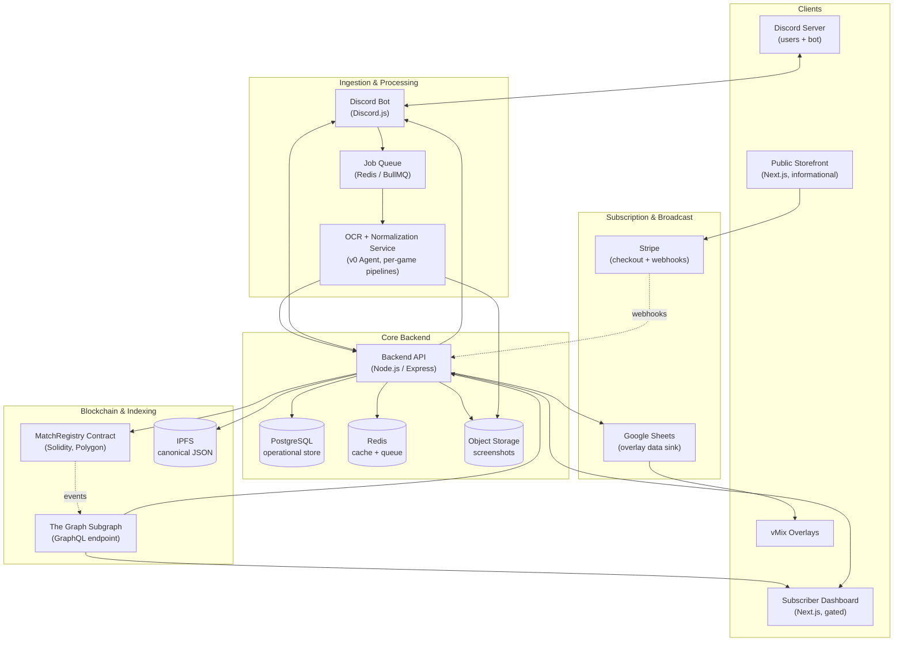
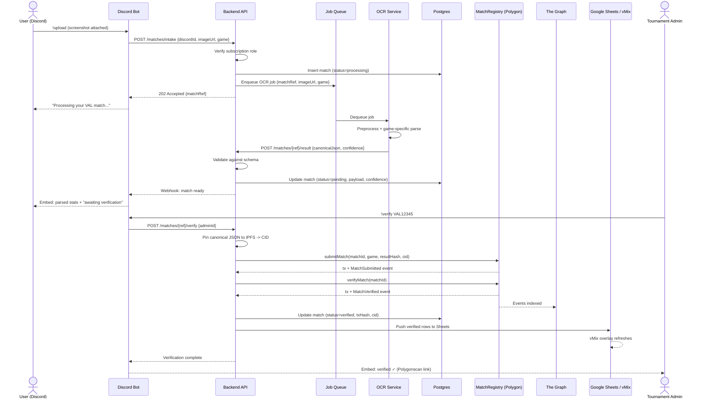
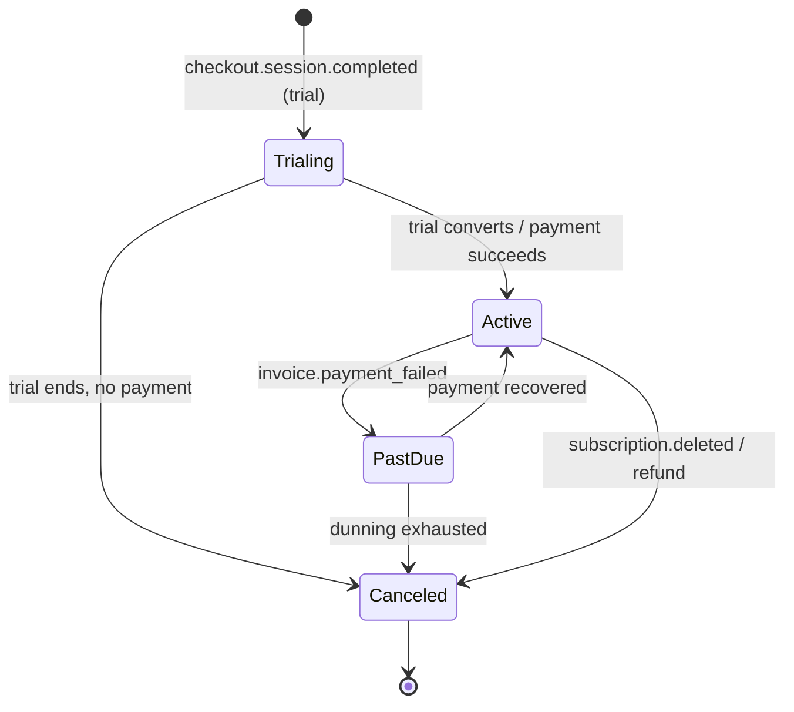

# ScoreVault — Technical Design & Build Document

**Esports results + broadcast automation platform**
Version 1.0 · Target build owner: ScoreVault Product Build Agent

---

## 1. Overview & Design Principles

ScoreVault ingests match screenshots from Discord, extracts player stats via per-game OCR, normalizes them into a canonical JSON schema, anchors verified results immutably on Polygon, indexes those results for fast querying via The Graph, and surfaces everything through a subscriber-gated dashboard that drives live broadcast overlays.

The public storefront stays purely informational and funnels visitors into a Stripe subscription. Everything operational lives behind that subscription gate.

**Guiding principles**

- **Async by default.** OCR, on-chain writes, and broadcast pushes never block the Discord interaction. A job queue decouples ingestion from processing.
- **Chain stores proof, not payload.** Storing full player arrays on-chain is expensive. We store the canonical-JSON hash plus an off-chain content pointer (IPFS CID), keeping gas low while preserving immutability and verifiability.
- **Read from the indexer, write to the chain.** Standings, MVP, and history queries hit the GraphQL indexer (cheap, fast). Only verification touches the chain.
- **One schema, everywhere.** A single canonical JSON schema is the contract between OCR, backend, chain, and dashboard. It is versioned and validated at every boundary.
- **Gate once, enforce everywhere.** Subscription status is the single source of truth that drives Discord roles AND dashboard access. The two stay in sync via webhook-driven reconciliation.

---

## 2. High-Level Architecture Diagram



---

## 3. Component Responsibilities

| Component | Stack | Responsibility |
|---|---|---|
| Discord Bot | Discord.js (Node) | Command handling (`!upload`, `!verify`, `!standings`), screenshot intake, role sync, embeds |
| OCR Service (v0 Agent) | Python (FastAPI worker) + Tesseract/cloud OCR | Per-game image → canonical JSON, confidence scoring, manual-review flagging |
| Backend API | Node.js / Express | Orchestration, schema validation, DB writes, chain writes, webhook handling, Sheets push |
| MatchRegistry | Solidity / Polygon | Immutable result anchoring, `matchId` uniqueness, event emission |
| Subgraph | The Graph / AssemblyScript | Index chain events → GraphQL for standings, MVPs, history |
| Storefront | Next.js | Marketing + Stripe checkout funnel (no gated data) |
| Dashboard | Next.js | Verification UI, broadcast controls, analytics (subscriber-only) |
| Postgres | Managed RDS/Cloud SQL | Users, subscriptions, pending/verified matches, audit log |
| Redis | Managed cache | Job queue (BullMQ) + standings cache |
| Object Storage | S3/GCS | Raw screenshots, OCR debug artifacts |

---

## 4. Component Interaction Diagram (Upload → Verify → Broadcast)



---

## 5. Canonical Data Model

The canonical JSON is the single source of truth flowing through every layer. It is versioned via `schemaVersion` so future game additions never break existing consumers.

### 5.1 Canonical match object

```json
{
  "schemaVersion": "1.0",
  "game": "Valorant",
  "matchId": "VAL12345",
  "tournamentId": "SCRIM-2026-Q2",
  "players": [
    {
      "name": "AceHunter",
      "team": "A",
      "kills": 20,
      "deaths": 15,
      "assists": 5,
      "stats": { "acs": 287, "adr": 156.2, "firstBloods": 4 }
    }
  ],
  "result": { "teamA": 13, "teamB": 11, "winner": "A" },
  "timestamp": "2026-06-02T19:30:00Z",
  "source": { "discordId": "1029384756", "channelId": "55667788" },
  "ocr": { "engine": "tesseract-5", "confidence": 0.94, "reviewRequired": false }
}
```

The `players[].stats` object is a free-form, per-game extension bag. Core fields (`kills`, `deaths`, `assists`) are guaranteed across all games; `stats` holds game-specific metrics (Valorant ACS, CS2 ADR, LoL CS/gold). This keeps the cross-game schema stable while allowing richness.

### 5.2 JSON Schema (validation contract)

```json
{
  "$schema": "https://json-schema.org/draft/2020-12/schema",
  "$id": "https://scorevault.gg/schemas/match-1.0.json",
  "type": "object",
  "required": ["schemaVersion", "game", "matchId", "players", "timestamp"],
  "properties": {
    "schemaVersion": { "const": "1.0" },
    "game": { "enum": ["Valorant", "CS2", "LoL"] },
    "matchId": { "type": "string", "pattern": "^[A-Z]{2,4}[0-9]{3,}$" },
    "tournamentId": { "type": "string" },
    "players": {
      "type": "array", "minItems": 1,
      "items": {
        "type": "object",
        "required": ["name", "kills", "deaths", "assists"],
        "properties": {
          "name": { "type": "string", "minLength": 1 },
          "team": { "type": "string" },
          "kills": { "type": "integer", "minimum": 0 },
          "deaths": { "type": "integer", "minimum": 0 },
          "assists": { "type": "integer", "minimum": 0 },
          "stats": { "type": "object" }
        }
      }
    },
    "result": { "type": "object" },
    "timestamp": { "type": "string", "format": "date-time" },
    "ocr": {
      "type": "object",
      "properties": {
        "confidence": { "type": "number", "minimum": 0, "maximum": 1 },
        "reviewRequired": { "type": "boolean" }
      }
    }
  }
}
```

**Blockchain-readiness rule:** the on-chain `resultHash` is `keccak256` of the canonicalized JSON (sorted keys, no whitespace). The same canonicalization function MUST be used by the backend before both hashing and IPFS pinning so the hash is reproducible by anyone.

---

## 6. Smart Contract Design

**Network:** Polygon (Amoy testnet → mainnet). **Language:** Solidity ^0.8.24.

On-chain we store only proof and a pointer — never full player arrays — to keep gas predictable and low.

```solidity
// SPDX-License-Identifier: MIT
pragma solidity ^0.8.24;

import "@openzeppelin/contracts/access/AccessControl.sol";

contract MatchRegistry is AccessControl {
    bytes32 public constant SUBMITTER_ROLE = keccak256("SUBMITTER_ROLE");
    bytes32 public constant VERIFIER_ROLE  = keccak256("VERIFIER_ROLE");

    enum Status { None, Submitted, Verified }

    struct Match {
        string  game;
        bytes32 resultHash;   // keccak256 of canonical JSON
        string  cid;          // IPFS content id of canonical JSON
        address submitter;
        address verifier;
        uint64  submittedAt;
        uint64  verifiedAt;
        Status  status;
    }

    // keccak256(matchId) => Match, enforces global uniqueness
    mapping(bytes32 => Match) private matches;

    event MatchSubmitted(
        string indexed matchId, string game, bytes32 resultHash,
        string cid, address submitter, uint64 timestamp
    );
    event MatchVerified(
        string indexed matchId, address verifier, uint64 timestamp
    );

    constructor(address admin) {
        _grantRole(DEFAULT_ADMIN_ROLE, admin);
        _grantRole(SUBMITTER_ROLE, admin);
        _grantRole(VERIFIER_ROLE, admin);
    }

    function submitMatch(
        string calldata matchId,
        string calldata game,
        bytes32 resultHash,
        string calldata cid
    ) external onlyRole(SUBMITTER_ROLE) {
        bytes32 key = keccak256(bytes(matchId));
        require(matches[key].status == Status.None, "matchId exists");

        matches[key] = Match({
            game: game, resultHash: resultHash, cid: cid,
            submitter: msg.sender, verifier: address(0),
            submittedAt: uint64(block.timestamp), verifiedAt: 0,
            status: Status.Submitted
        });

        emit MatchSubmitted(matchId, game, resultHash, cid, msg.sender, uint64(block.timestamp));
    }

    function verifyMatch(string calldata matchId) external onlyRole(VERIFIER_ROLE) {
        bytes32 key = keccak256(bytes(matchId));
        require(matches[key].status == Status.Submitted, "not submittable state");

        matches[key].status = Status.Verified;
        matches[key].verifier = msg.sender;
        matches[key].verifiedAt = uint64(block.timestamp);

        emit MatchVerified(matchId, msg.sender, uint64(block.timestamp));
    }

    function getMatch(string calldata matchId) external view returns (Match memory) {
        return matches[keccak256(bytes(matchId))];
    }
}
```

**Uniqueness** is enforced by the `require(matches[key].status == Status.None)` guard keyed on `keccak256(matchId)`. **Authorization** uses OpenZeppelin AccessControl so the backend's relayer wallet holds `SUBMITTER_ROLE`/`VERIFIER_ROLE` and end users never sign. Anyone can independently verify integrity by fetching the CID, canonicalizing, hashing, and comparing to `resultHash`.

---

## 7. Indexing Layer (The Graph)

The subgraph turns the two events into queryable entities so the dashboard and bot never have to scan the chain.

### 7.1 GraphQL schema (`schema.graphql`)

```graphql
type Match @entity {
  id: ID!              # matchId
  game: String!
  resultHash: Bytes!
  cid: String!
  status: String!      # SUBMITTED | VERIFIED
  submitter: Bytes!
  verifier: Bytes
  submittedAt: BigInt!
  verifiedAt: BigInt
}

type PlayerStanding @entity {
  id: ID!              # game-playerName
  game: String!
  player: String!
  matchesPlayed: Int!
  totalKills: Int!
  totalDeaths: Int!
  totalAssists: Int!
}
```

> Note: player-level standings are derived. The subgraph can index match-level data from events directly; player aggregates are computed by a backend job that reads verified matches (which carry the full player array off-chain) and writes `PlayerStanding` rows into Postgres, exposed via the backend GraphQL gateway. Pure on-chain standings are limited to what events carry.

### 7.2 Sample queries

```graphql
# Match history (multi-game)
query History($games: [String!]) {
  matches(where: { game_in: $games, status: "VERIFIED" },
          orderBy: verifiedAt, orderDirection: desc, first: 50) {
    id game cid verifiedAt
  }
}

# Standings (from backend gateway, aggregated)
query Standings($game: String!) {
  playerStandings(where: { game: $game },
                  orderBy: totalKills, orderDirection: desc) {
    player matchesPlayed totalKills totalDeaths totalAssists
  }
}
```

### 7.3 Mapping handler (AssemblyScript, abridged)

```typescript
export function handleMatchSubmitted(event: MatchSubmitted): void {
  let m = new Match(event.params.matchId);
  m.game = event.params.game;
  m.resultHash = event.params.resultHash;
  m.cid = event.params.cid;
  m.submitter = event.params.submitter;
  m.submittedAt = event.params.timestamp;
  m.status = "SUBMITTED";
  m.save();
}

export function handleMatchVerified(event: MatchVerified): void {
  let m = Match.load(event.params.matchId);
  if (m == null) return;
  m.status = "VERIFIED";
  m.verifier = event.params.verifier;
  m.verifiedAt = event.params.timestamp;
  m.save();
}
```

---

## 8. API Specifications

### 8.1 Bot ↔ Backend (internal REST, service-to-service auth via shared HMAC)

| Method | Path | Body | Returns |
|---|---|---|---|
| POST | `/v1/matches/intake` | `{ discordId, channelId, game, imageUrl }` | `202 { matchRef }` |
| POST | `/v1/matches/{ref}/verify` | `{ adminDiscordId }` | `200 { txHash, status }` |
| GET | `/v1/standings` | query: `game`, `limit` | `200 { standings[] }` |
| POST | `/v1/discord/roles/sync` | `{ discordId, action: "grant"\|"revoke" }` | `200 { ok }` |
| GET | `/v1/subscription/{discordId}` | — | `200 { active, plan, expiresAt }` |

### 8.2 OCR Service → Backend (worker callback)

| Method | Path | Body | Returns |
|---|---|---|---|
| POST | `/v1/matches/{ref}/result` | `{ canonicalJson, confidence, reviewRequired }` | `200 { accepted, schemaValid }` |

### 8.3 Dashboard ↔ Backend (browser, Discord-OAuth bearer)

| Method | Path | Purpose |
|---|---|---|
| GET | `/v1/me` | Session + subscription status (gate check) |
| GET | `/v1/matches?status=pending` | Verification queue |
| POST | `/v1/matches/{ref}/verify` | Trigger on-chain verification |
| POST | `/v1/matches/{ref}/correct` | Edit OCR output before verify (audit-logged) |
| GET | `/v1/analytics/{game}` | Aggregated stats for charts |
| POST | `/v1/broadcast/push` | Push selected match to Sheets/vMix |

### 8.4 Blockchain interface (contract ABI surface)

| Function | Caller | Effect |
|---|---|---|
| `submitMatch(matchId, game, resultHash, cid)` | Backend relayer | Writes match, emits `MatchSubmitted` |
| `verifyMatch(matchId)` | Backend relayer | Marks verified, emits `MatchVerified` |
| `getMatch(matchId)` | Anyone (view) | Reads stored proof |

### 8.5 Stripe → Backend (webhook)

| Event | Action |
|---|---|
| `checkout.session.completed` | Create subscription, grant Discord role, unlock dashboard, DM welcome |
| `customer.subscription.trial_will_end` | DM/email trial-ending notice |
| `customer.subscription.deleted` | Revoke role, lock dashboard, DM cancellation |
| `invoice.payment_failed` | Flag past-due, DM dunning notice |
| `charge.refunded` | Revoke access, audit-log refund |

All webhook handlers verify the Stripe signature, are **idempotent** (keyed on event id), and run reconciliation so Discord role state always matches DB state.

---

## 9. Discord Bot Design

Built on Discord.js with slash-command parity for the `!` prefix commands.

- **`!upload`** — validates the user holds an active-subscriber role, uploads the attached screenshot to object storage, calls `/matches/intake`, replies with an ephemeral "processing" message. Game is inferred from channel mapping or a `game:` argument.
- **`!verify <matchId>`** — restricted to a Tournament Admin role; calls `/matches/{ref}/verify`; replies with a Polygonscan link on success.
- **`!standings [game]`** — reads from the backend standings cache (Redis-backed), renders a paginated embed.
- **Role sync** — a reconciliation loop (and webhook-driven push) ensures every member's roles reflect their live subscription status. The bot exposes no direct DB access; it only calls backend endpoints.

---

## 10. OCR Service Design (v0 Agent)

A Python worker pool consuming the queue. One pipeline class per game, sharing a common preprocessing → parse → normalize → score flow.

```
preprocess  -> crop scoreboard ROI, deskew, grayscale, adaptive threshold, upscale
ocr engine  -> Tesseract 5 (LSTM) or cloud OCR for low-confidence retries
parse       -> game-specific column map (positional + regex)
normalize   -> emit canonical JSON (core K/D/A + stats bag)
score       -> per-field confidence; if < threshold => reviewRequired=true
```

Per-game parsers:
- **Valorant** — columns: Agent, Name, ACS, K, D, A; round score from header.
- **CS2** — Name, K, A, D (note CS2 ordering), ADR, HS%; map to canonical K/D/A.
- **LoL** — Champion, Name, KDA combined cell (split on `/`), CS, gold.

Low-confidence results are written with `reviewRequired: true` and surface in the dashboard verification queue with the original screenshot side-by-side for manual correction before on-chain submission. Workers autoscale on queue depth.

---

## 11. Subscription Lifecycle



State transitions are driven exclusively by signed, idempotent Stripe webhooks. Each transition (a) updates the Postgres subscription record, (b) calls the bot's role-sync endpoint, (c) flips the dashboard gate (enforced server-side on every `/v1/*` request via `/v1/me`), and (d) notifies the user by Discord DM and/or email. A nightly reconciliation job re-pulls Stripe subscription state and corrects any drift between Stripe, DB, and Discord roles.

---

## 12. Broadcast Integration

On verification, the backend writes the verified match's flattened rows to a designated Google Sheet via the Sheets API (service account). vMix data sources poll that sheet, so overlays update without operator intervention. The dashboard's broadcast controls let an operator choose which verified match is "live," reorder rows, and toggle overlay sections — each action is a `/v1/broadcast/push` call that rewrites the target sheet range.

---

## 13. Deployment & Infrastructure

| Service | Hosting | Scaling |
|---|---|---|
| Storefront + Dashboard | Vercel or containers behind CDN | Static/edge |
| Backend API | Containers — ECS Fargate / Cloud Run / AKS | Horizontal, CPU+RPS |
| Discord Bot | Single long-running container (sharded if >2500 guilds) | Vertical / shard count |
| OCR Workers | Containers | Autoscale on queue depth |
| Postgres | Managed (RDS / Cloud SQL) | Read replicas for analytics |
| Redis | Managed (ElastiCache / Memorystore) | — |
| Object Storage | S3 / GCS | — |
| Subgraph | Subgraph Studio (hosted) or self-hosted graph-node | — |
| Contracts | Polygon Amoy (staging) → mainnet | — |

All services are Dockerized in a monorepo (Turborepo). Example local topology:

```yaml
# docker-compose.yml (development)
services:
  api:
    build: ./apps/api
    env_file: .env
    ports: ["4000:4000"]
    depends_on: [postgres, redis]
  bot:
    build: ./apps/bot
    env_file: .env
    depends_on: [api]
  ocr:
    build: ./apps/ocr
    env_file: .env
    depends_on: [redis]
    deploy: { replicas: 2 }
  postgres:
    image: postgres:16
    environment: { POSTGRES_PASSWORD: dev }
    volumes: ["pgdata:/var/lib/postgresql/data"]
  redis:
    image: redis:7
volumes: { pgdata: {} }
```

---

## 14. CI/CD Pipeline

GitHub Actions, one workflow with path-filtered jobs so only changed services rebuild. Contracts and the subgraph have dedicated lifecycles.

```yaml
# .github/workflows/ci.yml
name: ci-cd
on:
  push: { branches: [main] }
  pull_request: {}

jobs:
  test:
    runs-on: ubuntu-latest
    steps:
      - uses: actions/checkout@v4
      - uses: actions/setup-node@v4
        with: { node-version: 20, cache: npm }
      - run: npm ci
      - run: npm run lint
      - run: npm test --workspaces
      - name: Contract tests
        run: cd packages/contracts && npx hardhat test

  build-and-deploy:
    needs: test
    if: github.ref == 'refs/heads/main'
    runs-on: ubuntu-latest
    permissions: { id-token: write, contents: read }
    strategy:
      matrix: { service: [api, bot, ocr] }
    steps:
      - uses: actions/checkout@v4
      - name: Build & push image
        run: |
          docker build -t $REGISTRY/scorevault-${{ matrix.service }}:${{ github.sha }} \
            ./apps/${{ matrix.service }}
          docker push $REGISTRY/scorevault-${{ matrix.service }}:${{ github.sha }}
      - name: Deploy
        run: ./deploy/rollout.sh ${{ matrix.service }} ${{ github.sha }}
```

**Contracts pipeline (separate trigger):** Hardhat/Foundry tests → deploy to Amoy → verify on Polygonscan → on tagged release, deploy to mainnet and publish the new address.
**Subgraph pipeline:** on contract-address change, regenerate types, `graph build`, `graph deploy` to Studio.

---

## 15. Security Considerations

- **Relayer key custody.** The wallet holding `SUBMITTER_ROLE`/`VERIFIER_ROLE` lives in a KMS/secrets manager; the API signs server-side. Rotate via `grantRole`/`revokeRole`.
- **Service-to-service auth.** Bot↔backend and OCR↔backend calls are signed with a rotating shared HMAC; no service trusts unauthenticated callers.
- **Webhook integrity.** Stripe signatures verified; handlers idempotent and replay-safe.
- **Dashboard gate enforced server-side.** Never trust the client; every gated endpoint checks live subscription status.
- **Upload hygiene.** Screenshots are size/type-validated, stored with random keys, and scanned before OCR.
- **Audit trail.** OCR corrections and verifications are append-only logged with actor + before/after.

---

## 16. Observability & Monitoring

- **Metrics:** queue depth, OCR latency/confidence distribution, on-chain tx success rate + gas, webhook failure rate, dashboard auth failures. (Prometheus/Grafana or cloud-native.)
- **Logs:** structured JSON, aggregated centrally.
- **Errors:** Sentry across bot, API, dashboard.
- **Alerts:** queue backlog, repeated tx failures, webhook signature failures, Discord/DB role drift, Sheets push failures.
- **Tracing:** request id propagated from Discord interaction through to chain tx for end-to-end debugging.

---

## 17. Build Roadmap

| Phase | Scope | Exit criteria |
|---|---|---|
| **1** | Bot (`!upload`) + OCR pipeline → Postgres | Screenshot in Discord produces validated canonical JSON in DB |
| **2** | `MatchRegistry` contract on Amoy + subgraph | Verified match anchored on-chain and queryable via GraphQL |
| **3** | Dashboard: verification queue + broadcast controls → Sheets/vMix | Operator verifies a match and it appears on a vMix overlay |
| **4** | Stripe subscription lifecycle + Discord role + dashboard gating | Subscription changes propagate to roles + access within seconds |
| **5** | Full Dockerized deploy, CI/CD, monitoring, mainnet | All services autoscaling in cloud with alerting and mainnet contract |

---

## 18. Developer Quickstart & Operator Runbook

**Developer quickstart**

1. `npm ci` at repo root (Turborepo monorepo).
2. Copy `.env.example` → `.env`; fill Discord token, Stripe keys, RPC URL, relayer key, Sheets creds.
3. `docker compose up` to bring up Postgres, Redis, API, bot, OCR.
4. `cd packages/contracts && npx hardhat node` + `npx hardhat run scripts/deploy.ts --network localhost`.
5. `npm run dev --workspace=dashboard` for the dashboard.

**Operator runbook (common tasks)**

- *OCR backlog growing:* check queue depth dashboard; scale OCR worker replicas; inspect low-confidence rate (may indicate a game UI change requiring a parser update).
- *Match stuck "submitted" not "verified":* check relayer wallet MATIC balance and recent tx failures; re-run `verifyMatch` via admin tooling.
- *Subscriber lost dashboard access unexpectedly:* run the reconciliation job; compare Stripe ↔ DB ↔ Discord role state.
- *Overlay not updating:* confirm `/v1/broadcast/push` succeeded and the Sheets service account still has edit access; verify vMix data source polling interval.
- *Contract redeploy:* update address in subgraph manifest, redeploy subgraph, update backend env, rotate relayer roles if the wallet changed.

---

*End of document.*
